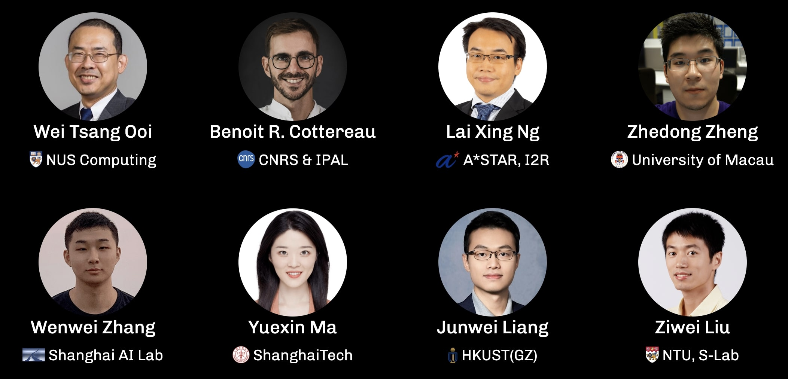

<h1 align="center">🤖 RoboSense Track 2:<br>Social Navigation</h1>


<div align="center">

**Official Baseline Implementation for [Track 2](https://robosense2025.github.io/track2)**

*Based on Falcon -- "From Cognition to Precognition: A Future-Aware Framework for Social Navigation"*<br>(https://github.com/Zeying-Gong/Falcon)

[](https://robosense2025.github.io/)
[](https://robosense2025.github.io/track2)
[](https://iros2025.org/)
[](https://eval.ai/web/challenges/challenge-page/2557/overview)
[](LICENSE)

**🏆 Prize Pool: $2,000 USD for Track 2 Winners**

<p align="center">
  
</p>

</div>

## Challenge Overview

**Track 2: Social Navigation** challenges participants to develop advanced RGBD-based perception and navigation systems that empower autonomous agents to interact safely, efficiently, and socially in dynamic human environments. 

Participants will design algorithms that interpret human behaviors and contextual cues to generate navigation strategies that strike a balance between navigation efficiency and social compliance. Submissions must address key challenges such as real-time adaptability, occlusion handling, and ethical decision-making in socially complex settings.

### 🎯 Objectives

This track evaluates an agent's ability to perform socially compliant navigation in dynamic indoor environments populated with realistic human agents. Participants must design navigation policies based solely on RGBD observations and odometry, without access to global maps or privileged information.

- **Social Norm Compliance**: Maintain safe distances, avoid collisions, and demonstrate socially acceptable behaviors.
- **Realistic Benchmarking**: Navigate in large-scale, photo-realistic indoor scenes with dynamic, collision-aware humans.
- **Egocentric Perception**: Operate from a first-person perspective, simulating how a robot would perceive its surroundings.


## Competition Details

- **Venue**: IROS 2025, Hangzhou (Oct 19-25, 2025)
- **Registration**: [Google Form](https://docs.google.com/forms/d/e/1FAIpQLSdwfvk-NHdQh9-REiBLCjHMcyLT-sPCOCzJU-ux5jbcZLTkBg/viewform) (Open until Aug 15)
- **Contact**: robosense2025@gmail.com


### 🏆 **Awards**

| Prize | Award |
|:-|:-|
| 🥇 1st Place | $1000 + Certificate |
| 🥈 2nd Place | $600 + Certificate |
| 🥉 3rd Place | $400 + Certificate |
| 🌟 Innovation Award | Cash Award + Certificate |
| Participation | Certificate |


## 📊 Official Dataset

This track uses the **RoboSense Track 2 Social Navigation Dataset**, which is based on the **Social-HM3D** benchmark and provides:

- **Goal-driven Trajectories**: Humans navigate with intent, avoiding random or repetitive paths
- **Natural Behaviors**: Movement includes walking, pausing, and realistic avoidance via ORCA
- **Balanced Density**: Human count is scaled to scene size, avoiding over- or under-crowding
- **Diverse Environments**: Includes 844 scenes for Social-HM3D

### Dataset Statistics

| Dataset         | Num. of Scenes | Scene Types                   | Num. of Humans | Natural Motion |
|----------------|----------------|-------------------------------|------------|----------------|
| **Social-HM3D** | 844            | Residence, Office, Shop, etc. | 0–6        | ✔️              |


### Baseline Performance (Phase 1)

The Falcon baseline achieves the following performance on the Phase I evaluation set using the **Social-HM3D** datasets (∼1,000 test episodes):

<!-- ``` -->
| Dataset       | Success ↑ | SPL ↑  | PSC ↑  | H-Coll ↓ |
|---------------|-----------|--------|--------|-----------|
| Social-HM3D   | 55.15     | 55.15  | 89.56  | 42.96     |
<!-- ``` -->

**Note**: These baseline results are based solely on depth input.
As the competition supports full RGB-D modalities, participants are encouraged to explore richer representations and surpass the baseline performance.

## 🚀 Quick Start

### 1. **Preparing conda env**

Assuming you have [conda](https://docs.conda.io/projects/conda/en/latest/user-guide/install/) installed, let's prepare a conda env:
```
conda_env_name=falcon
conda create -n $conda_env_name python=3.9 cmake=3.14.0
conda activate $conda_env_name
```

### 2. **conda install habitat-sim & habitat-lab**
Following [Habitat-lab](https://github.com/facebookresearch/habitat-lab.git)'s instruction:
```
conda install habitat-sim=0.3.1 withbullet -c conda-forge -c aihabitat
```

Then, assuming you have [this repository](https://github.com/robosense2025/track2.git) cloned (forked from Habitat 3.0), install the necessary dependencies of Habitat.
```
git clone --recurse-submodules https://github.com/robosense2025/track2.git # to download the submodule
cd Falcon
pip install -e habitat-lab
pip install -e habitat-baselines
```

### 3. **Downloading the Social-HM3D datasets （For RoboSense 2025 Competition）**

- Download Scene Datasets

Follow the instructions for **HM3D** in Habitat-lab's [Datasets.md](https://github.com/facebookresearch/habitat-lab/blob/main/DATASETS.md). By default, the download script fetches version 0.2 of the HM3D dataset, which includes only the assets required for use with Habitat-Sim.

```
python -m habitat_sim.utils.datasets_download --username <api-token-id> --password <api-token-secret> --uids hm3d
```

You can also add _full to the uid to download the raw glbs in addition to what is needed for use with Habitat-Sim.

```
python -m habitat_sim.utils.datasets_download --username <api-token-id> --password <api-token-secret> --uids hm3d_full
```

- Download Episode Datasets (Phase 1 Only)

Download social navigation (SocialNav) episodes for the test scenes, which can be found here: [Link](https://huggingface.co/datasets/robosense/datasets/tree/main/track2-social-navigation).

After downloading, unzip and place the datasets in the default location:
```
unzip -d data/datasets/pointnav
```
- Download Leg animation:

```
wget https://github.com/facebookresearch/habitat-lab/files/12502177/spot_walking_trajectory.csv -O data/robots/spot_data/spot_walking_trajectory.csv
```

- Download the multi-agent necessary data:

```
python -m habitat_sim.utils.datasets_download --uids habitat_humanoids hab3_bench_assets hab_spot_arm
```

The file structure should look like this:

```
Falcon/
└── data/
    ├── datasets
    │   └── pointnav
    │       └── social-hm3d
    │           ├── train
    │           │   ├── content
    │           │   └── train.json.gz
    │           └── val
    │               ├── content
    │               └── val.json.gz
    ├── scene_datasets
    ├── robots
    ├── humanoids
    ├── versoned_data
    └── hab3_bench_assets
```

Note that here the definition of SocialNav is different from the original task in [Habitat 3.0](https://arxiv.org/abs/2310.13724).


### 4. Evaluation Falcon Baseline

The pretrained models can be found in [this link](https://drive.google.com/drive/folders/1Bx1L9U345P_9pUfADk3Tnj7uK01EpxZY?usp=sharing). Download it to `pretrained_model/` under the root directory.

You can evaluate it on the Social-HM3D datasets using the following template:

```
python -u -m habitat-baselines.habitat_baselines.eval \
--config-name=social_nav_v2/falcon_hm3d.yaml
```

### 5. Docker Evaluation Environment

We provide a standardized Docker environment for remote evaluation to ensure consistency and reproducibility across all submissions.

#### 🧱 Evaluation Docker Image

All submissions will be evaluated inside the following Docker image:

- **Phase 1**: Evaluations were run inside  
  ```bash
  docker pull zeyinggong/robosense_socialnav:v0.5
  ```

- **Phase 2**: Evaluations will use
  ```bash
  docker pull zeyinggong/robosense_socialnav:v0.7
  ```

**Changes in v0.7**:

1. Fixed driver compatibility issues because of EGL error

2. Phase 2 now supports up to 8 environments, including single-environment inference.

3. **Update action space**: in Phase 1, action 0 (stop) did not terminate the episode. In Phase 2, the action set has been refined to clearly distinguish between **stopping** *(ending an episode)* and **pausing** *(remaining stationary without ending)*. A new **move_backward** action is also introduced, enabling the robot to retreat when needed for better social compliance and obstacle avoidance. The updated action space is:

```
0 - stop            # now correctly ends the episode
1 - move_forward
2 - turn_left
3 - turn_right
4 - move_backward   # newly added action for moving backward
5 - pause           # newly added action for pausing without movement
```

This action space is fully backward-compatible with Phase 1, ensuring smooth transition for existing methods.

Participants are strongly encouraged to develop and test their pipelines locally using this image to ensure compatibility with the evaluation server.

#### 📦 Submission Packaging

Submissions will be evaluated inside the container under `/app/Falcon/`. The evaluator will unzip your `submission.zip` or load your `actions.json` file into `/app/Falcon/input/` inside the container.

>  For Phase 2, only a **complete code submission (submission.zip)** will be accepted. We may perform additional audits for the top-performing teams in both test phases.

- **Code Submissions (`submission.zip`)**: Your archive must be structured as follows:

```
submission.zip
├── run.sh             # The main script to be executed (must be executable).
├── config.yaml        # An optional YAML configuration file for inference.
├── model.pth          # Optional pretrained model weights.
├── custom_policy.py   # An optional file containing your custom policy or inference logic.
└── ...                # Any other necessary files.
```

Your `run.sh` entry point will be called directly.

- **Action Submissions (`actions.json`)**: Only supported in **Phase 1**. The evaluator will run:

```bash
python -u -m habitat_baselines.eval --config-name=social_nav_v2/falcon_hm3d_replay.yaml
```

> To simplify submissions, all evaluation data directories for Minival, Phase 1, and Phase 2 are mapped to the same location inside the container: `/app/Falcon/data/datasets/pointnav/social-hm3d/minival`. This means your code **only needs to be compatible with a single directory structure** like the one used for minival.

#### 🧪 Local Testing (Recommended)

- Phase 1

  You can test your submission locally before uploading to EvalAI:

  ```bash
  docker run --rm -it \
      --gpus all \
      --runtime=nvidia \
      -v /path/to/your/submission:/app/Falcon/input:ro \
      -v /path/to/your/data:/app/Falcon/data:ro \
      zeyinggong/robosense_socialnav:v0.5
  ```

  Inside the container, navigate to `/app/Falcon/` and manually execute your `run.sh` or replay evaluator command to verify correctness.

  > **Tip:** You may refer to the provided [Baseline ZIP Submission Example (Updated)](https://drive.google.com/file/d/1k5tMeocASZhCUL2SFUILqWTszNRYjC4L/view?usp=sharing) and [Baseline Action Submission Example](https://drive.google.com/file/d/1N-G9jCuysbuDvTeuYpOCCC9IO9PdDhRS/view?usp=sharing) for reference.

- Phase 2

  For this phase, we recommend using Docker image version v0.7, which is optimized with an improved action space and enhanced environment setup. Please note that Phase 2 **does not support action submissions** due to the dataset not being publicly available.

  You can test your submission locally before uploading to EvalAI:

  ```bash
  docker run --rm -it \
      --gpus all \
      --runtime=nvidia \
      -v /path/to/your/submission:/app/Falcon/input:ro \
      -v /path/to/your/data:/app/Falcon/data:ro \
      zeyinggong/robosense_socialnav:v0.7
  ```

  You can manually execute your `run.sh` inside the container to verify correctness.

  > **Tip:** You may refer to the provided [Baseline ZIP Submission Example (Updated)](https://drive.google.com/file/d/1k5tMeocASZhCUL2SFUILqWTszNRYjC4L/view?usp=sharing) for reference.


#### ⏱ Evaluation Time

- Minival Phase: typically 5–10 minutes.
- Phase 1 Full Evaluation: may take 3–5 hours, depending on queue length and inference runtime.
- Phase 2 Full Evaluation: may take 2–4 hours, depending on the number of environments used for inference, queue length, and inference runtime.

If your submission remains pending for over 48 hours, please open an issue on our GitHub repository: [issues](https://github.com/robosense2025/track2/issues). You may also contact us via email at [robosense2025@gmail.com](mailto:robosense2025@gmail.com) if necessary.


## 🎖️ Challenge Participation

### Submission Requirements
1. **Phase 1**: Submit results on public test set 
2. **Phase 2**: Final evaluation on private test set with reproducible code
3. **Code**: Submit reproducible code with your final results
4. **Model**: Include trained model weights
5. **Report**: Technical report describing your approach

## 📏 Evaluation Metrics

Our benchmark focuses on two key aspects: **task completion** and **social compliance**.

| Metric      | Description |
|-------------|-------------|
| **SR** (Success Rate)       | Fraction of episodes where the robot successfully reaches the goal. |
| **SPL** (Success weighted by Path Length) | Penalizes inefficient navigation. Rewards shorter, successful paths. |
| **PSC** (Personal Space Compliance) | Measures how well the robot avoids violating human personal space. A higher PSC indicates better social behavior. The threshold is set to **1.0m**, considering a **0.3m** human radius and **0.25m** robot radius. |
| **H-Coll** (Human Collision Rate) | The proportion of episodes involving any human collision. Collisions imply task failure. |
| **Total Score** | Weighted combination of the core metrics:  **Total = 0.4 × SR + 0.3 × SPL + 0.3 × PSC**. This score reflects overall navigation quality while implicitly penalizing human collisions. |

> Note: The evaluation metrics and scoring formula remain the same for both Phase 1 and Phase 2. The final rankings and awards will be determined exclusively by the results from **Phase 2**. Rankings are based on the `Total Score`, with ties broken by the higher **Success Rate (SR)**.

### Timeline
- **Registration**: [Google Form](https://docs.google.com/forms/d/e/1FAIpQLSdwfvk-NHdQh9-REiBLCjHMcyLT-sPCOCzJU-ux5jbcZLTkBg/viewform)
- **Awards Announcement**: IROS 2025. Awards will only be granted to submissions that have successfully passed the reproducibility audit.
#### Phase 1 

Public test set evaluation (~1000 episodes)

**Deadline: August 15th, 2025 (AoE)**

**Leaderboard Visibility**: The leaderboard for **Phase 1** is **public**. Your submissions will be visible on the leaderboard as soon as they are successfully evaluated, allowing you to track your progress and compare with other teams.

---

#### Phase 2 

Private test set evaluation (~500 episodes)

**Note**: Teams that were unable to submit any evaluations during Phase 1 are still welcome to continue participating in Phase 2. The final ranking will be determined solely by the results from Phase 2.

**Deadline: September 15th, 2025 (AoE)**

- **Leaderboard Visibility**: The leaderboard for **Phase 2** is **private** and will not be publicly revealed until after the competition concludes. However, participants can see if their own submissions appear on the private leaderboard to confirm that they have been successfully processed and evaluated.

- **Final Submission**: For Phase 2, only a **complete code submission (`submission.zip`)** will be accepted. Your final submission must contain all code, configurations, and trained model weights necessary to reproduce your results.

- **Reproducibility Audit**: The organizing team will audit the submissions of top-performing teams to verify their reproducibility. We will execute your code in the official Docker environment and compare the results with the public leaderboard scores.

- **Disqualification**: Any submission found to be in violation of the rules will be disqualified. This includes, but is not limited to, submissions that:
    - Do not run an actual inference and simulation pipeline within the container.
    - Produce a fabricated `result.json` file by bypassing the intended evaluation logic.
    - Fail to reproduce the results on the leaderboard during the audit process.

## 🔗 Resources

- **Challenge Website**: [robosense2025.github.io](https://robosense2025.github.io/)
- **Track Details**: [Track 2 Page](https://robosense2025.github.io/track2)
- **Track Dataset**: [HuggingFace Dataset](https://huggingface.co/datasets/robosense/datasets/tree/main/track2-social-navigation)
- **Baseline Paper**: [arXiv:2409.13244](https://arxiv.org/pdf/2409.13244)
- **Baseline Model**: [Google Drive](https://drive.google.com/drive/folders/1Bx1L9U345P_9pUfADk3Tnj7uK01EpxZY)


## 📧 Contact & Support

- **Email**: robosense2025@gmail.com
- **Official Website**: https://robosense2025.github.io
- **Issues**: Please use GitHub Issues for technical questions


## 📄 Citation

If you use the code and dataset in your research, please cite:

```bibtex
@article{gong2024cognition,
  title = {From Cognition to Precognition: A Future-Aware Framework for Social Navigation},
  author = {Gong, Zeying and Hu, Tianshuai and Qiu, Ronghe and Liang, Junwei},
  journal = {arXiv preprint arXiv:2409.13244},
  year = {2024}
}

@article{robosense2025track2,
  title     = {RoboSense Challenge 2025: Track 2 - Social Navigation},
  author    = {RoboSense Challenge Organizers},
  booktitle = {IROS 2025},
  year      = {2025},
  url       = {https://robosense2025.github.io/track2}
}
```


## Acknowledgements

### RoboSense 2025 Challenge Organizers

<p align="center">
  
</p>


### RoboSense 2025 Program Committee

<p align="center">
  
</p>


---

<div align="center">

**🤖 Ready to sense the world robustly? Register now and compete for $2,000!**

[**📝 Register Here**](https://docs.google.com/forms/d/e/1FAIpQLSdwfvk-NHdQh9-REiBLCjHMcyLT-sPCOCzJU-ux5jbcZLTkBg/viewform) | [**🌐 Challenge Website**](https://robosense2025.github.io/) | [**📧 Contact Us**](mailto:robosense2025@gmail.com)

Made with ❤️ by the RoboSense 2025 Team

</div>
